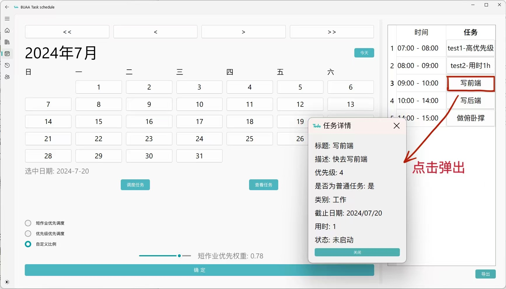

# 大作业项目总结报告

```
题目:D题
组号:17组
小组成员:
马赛克掉
```

## 一、功能简介

1. 用户注册、登录和个人信息管理：用户可自行更改头像、账号、昵称、邮箱、工作时间等
2. 创建、读取、更新、完成、删除任务
3. 日常任务：日常任务每天都会自动出现在任务列表中
4. 筛选任务：筛选指定时间段、优先级、类型、状态的任务
5. 查看任务：通过日历系统，查看指定日期的任务计划
6. 调度任务：用户提供空闲时间，支持短作业优先调度、优先级优先调度、自定义比例等不同任务调度方式
7. 回顾任务：对指定时间范围内过往任务数据进行可视化统计分析
8. 文件导入导出：批量导入任务，批量导出任务计划
9. 激励任务：倒计时/正计时用户设定的事件，激励用户完成任务

## 二、已完成任务

### 必做任务完成情况（7/7）

1.  用户登录及个人信息系统：填写用户基本信息，可自行设计需要填写的项目，并使用数据库存储。✔
2.  CRUD：（创建、读取、更新、删除）任务的操作，包括标题、内容描述、截止时间、重要性等， 还可以允许修改和删除任务。  注意：需要数据库存储。 ✔
3.  任务状态区分。未启动、正在进行、已完成和已过期的任务状态以可视化的形式清晰区分。✔
4.  任务完成确认。当任务完成时，用户可以使用某种方法，例如打勾来消除任务。  ✔
5.  任务提醒：从任务开始按时间筛选显示任务，特别是显示今天需要完成的任务，并以可视化的形式明确显示任务是否紧急。✔
6.  日历系统。您可以通过浏览日历来查看某个月的每个日期的任务计划。✔
7.  任务调度。通过设置任务列表，提供空闲时间，系统会以一定的任务调度方式自动安排任务计划。任务调度方法只要合理，可以自己设计。  ✔

### 选做任务完成情况（8/8）

1. 带权重的任务调度通过设置任务列表，为任务设置优先级权重，并给出空闲时间，自动安排 任务计划。✔
2. 支持日常任务。对于日常任务，只需设置一次，在指定时间内，每天都会自动出现在 任务列表中。✔
3. 任务类别划分，设置任务类别，如运动、学习等。✔
4. 任务回顾。能够根据历史任务完成数据进行可视化数据分析。✔
4. （自定义）实现用户的修改头像、账号、昵称、邮箱、工作时间等，退出账号的功能，使用服务器支持多用户登录登出。✔
6. （自定义）首页提供用户手册及使用教程视频，方便用户使用时查看。✔
7. （自定义）支持以`.txt`格式批量导入任务，支持批量导出`excel`表格格式的任务计划。✔
8. （自定义）在个人信息页新增激励任务，对用户设定的事件进行倒计时/正计时，并支持编辑和删除。✔


## 三、总体设计方案

项目主要包括**数据库**、**登录系统**、**任务系统**、**个人信息系统**四大部分，任务系统又细分为**用户指导页**、**任务创建页**、**任务计划页**、**历史数据分析页**等子页面。

### 3.1 数据库

我们决定将 MySQL 数据库部署在阿里云服务器上，以简化用户操作并提升系统稳定性，主要优点在于：

- **集中管理**：用户数据集中存储于服务器端，便于数据管理和备份。
- **无需本地环境**：用户无需在本地安装 MySQL，降低了使用门槛。
- **自动维护**：云服务提供商负责数据库的维护、更新和安全问题。

下图是本项目的服务器信息。


得益于服务器的强大能力，我们可以迅速快捷地支持数据的增删查改和图片上传等服务。后续迭代也可以轻松支持群组自习室任务、多人任务协同等功能。

#### 方法与接口

为了实现功能全面的后端，我们基于 `pymysql` 库设计了一套接口，用于管理用户个人信息和任务数据的增、删、改、查操作，实现了数据与业务逻辑的解耦。（相关实现见 `database.py` 文件）

| 函数方法                      | 功能                             |
| ----------------------------- | -------------------------------- |
| `connect_database`            | 数据库连接                       |
| `sign_up_database`            | 数据库端实现注册                 |
| `login_in_database`           | 数据库端实现登录                 |
| `get_user_database`           | 数据库端获取当前用户信息         |
| `modify_user_database`        | 数据库端获取更新用户信息         |
| `get_task_list_database`      | 数据库端实现获取当前用户任务列表 |
| `add_task_database`           | 数据库端实现添加任务             |
| `delete_task_databse`         | 数据库端实现删除任务             |
| `modify_task_database`        | 数据库端实现修改任务             |
| `modify_task_state_database`  | 数据库端实现修改任务状态         |
| `update_timer_state_database` | 数据库端实现定期修改过期任务状态 |
| `get_hope_list_database`      | 数据库端实现获取当前用户激励列表 |
| `add_hope_database`           | 数据库端实现添加激励             |
| `modify_hope_database`        | 数据库端实现修改激励             |
| `delete_hope_database`        | 数据库端实现删除激励             |

采用面向对象方法设计思想，设计`User`、`Task`、`Hope`类，前端和后端之间通过传递这些类的实例，实现数据的增、删、改、查（相关实现见 `user.py` 、`task.py`、`hope.py`文件）

- `User`类

  存储任务的基本信息，其属性有用户的id、账号、密码、邮箱、工作时间以及头像url链接等。

- `Task`类

  存储任务的基本信息，其属性有标题、描述、时间、类别以及当前状态等。日常任务也可转化为`Task`进行调用

- `Hope`类

  存储激励的基本信息，其属性有标题和时间。

  

### 3.2 登录系统

我们设计了一个简洁、直观的登录系统界面。界面采用固定大小，左侧为我们的程序Logo，右侧为输入区域，包含登录和注册两个选项，方便用户管理他们的账号。

登录界面要求用户输入账号和密码，以确保只有注册用户才能访问应用程序。用户初次使用时，可以选择注册一个新账号。此外，我们还设计了一个`注册后直接登录`的选项，提升了用户体验。


至此便创建并启动了应用程序，同时显示登录窗口。在用户成功登录后，会首先进入一个显示我们Logo的欢迎界面。随后，用户将被引导至程序的正常使用部分，可以开始使用应用程序的各项功能。


核心代码如下：

```python
class login_main(Ui_login, QWidget):
    def __init__(self, parent=None):
        super().__init__(parent)
        self.setupUi(self)
        self.id = id
        self.initUI()
        connect_database() #连接数据库
   
    def handle_login(self):
		# 从前端解析登录有关字符串
        
        result, id, message = login_in_database(account, password) # 后端登录
        if result:
            # 成功登录 跳转主界面
            self.close()
            MainWindow = main_main.window_main(id=id)
            MainWindow.show()

        else:
            # 登录错误
            

    def handle_register(self):
        # 从前端解析注册有关字符串
        
        if not account or not email or not password or not confirm:
            # 输入为空错误
        elif password != confirm:
            # 密码不相同错误
        else:
            result, message = sign_up_database(account, email, password) # 后端注册
            if result:
                #注册成功
				#是否为注册后直接登录
                if self.auto_login_checkbox.isChecked():
                    self.account_input_login.setText(account)
                    self.password_input_login.setText(password)
                    self.handle_login()
                else:
                    self.show_login_form()
             else: #其他错误
```


### 3.3 用户指导页

进入程序后左侧栏分为以下部分：使用说明栏 `document`，任务创建栏 `home`，任务计划栏 `arrange`，历史数据分析栏 `history`，个人信息栏`profile`。用户可以在左下角的太阳图标中选择`白天/黑暗`模式。

下图便是我们进入程序的首页界面了，其内容主要分为左侧的用户使用文档栏和右侧的视频介绍栏，以在用户在使用本程序时作为引导。


在前端代码层面上，程序的五个主要页面采用了相同的实现框架，下面就以这里的使用说明栏为例进行介绍。

`document_main.py`实现了核心的`VideoPlayer` 类，继承自 `Ui_document` 和 `QWidget`，主要完成初始化界面，包括设置窗口图标和标题；创建主布局，包含分割器和滚动区域。该类还定义了完成与用户交互所需的辅助函数。

`document_ui.py`文件主要是定义了	`Ui_document`类（供`document_main.py`中的类继承），此外提供了`setupUi()`函数。

核心代码如下：

```python
class VideoPlayer(Ui_document, QWidget):
    def __init__(self, parent=None):
        super().__init__(parent)
        self.setupUi(self)
        self.initUI()
        self.setWindowIcon(QIcon('logo.png'))

    def initUI(self):
        self.setWindowTitle('Video Player')
        self.setGeometry(100, 100, 1000, 700)

        # 创建主布局
        self.main_layout = QHBoxLayout()
        splitter = QSplitter(Qt.Horizontal)

        # 创建文档说明标签并设置内容
        self.doc_label = QLabel(self)
        self.doc_label.setText(...)
        # omit: 其余调整排版的语句
        
        # 创建视频布局、显示视频组件、创建播放控制按钮、创建进度滑动条
        # 设置 splitter 初始比例，初始化视频捕捉，获取视频总帧数，显示视频第一帧
        self.video_layout = QVBoxLayout()
        self.video_layout.addStretch()
        self.video_label = QLabel(self)
        self.video_label.setAlignment(Qt.AlignCenter)
        self.video_label.setFixedSize(500, 500)
        self.video_layout.addWidget(self.video_label)
		# omit...

        # 视频初始状态为暂停
        self.playing = False

    # 其余功能实现函数
    def toggle_play(self):
        # ...

    def pause_video(self):
        self.timer.stop()

    def resume_video(self):
        # ...
        
    def update_slider_position(self, position):
        # ...

    def set_position(self, position):
        # ...

    def update_frame(self):
        # ...
```


### 3.4 任务创建页

本页面用于创建新任务，并支持按特定条件筛选并显示创建过的所有任务。

本页同样遵循上述基本框架，前端实现由`home_main.py`和`home_ui.py`完成。核心类为`TodoApp`，前端核心代码如下：

```python
class TodoApp(Ui_home, QWidget):
    def __init__(self, id):
        super().__init__()
        self.id = id
        self.setupUi(self)
        self.initUI()
        self.setWindowIcon(QIcon('logo.png'))
        self.setWindowTitle('TODO')

    def initUI(self):
        # 设置页面尺寸，各选择器及按钮的位置
        # omit...

        # 按钮与函数的连接(omit部分)
        self.addButton.clicked.connect(self.openTaskDialog) # 连接至openTaskDialog函数
        self.saveButton.clicked.connect(self.accept) # 由于保存时需要有条件判断，我们重写accept函数
        self.initTask()

    def initTask(self):
        ls = get_task_list_database(self.id) # 与后端连接
        for task in ls:
            self.addTask_ui(task)

    def addTask_ui(self, task):
        # omit...
       	editButton = QPushButton('✎')
        editButton.clicked.connect(lambda: self.editTask(taskLabel, taskInfoLabel))
        deleteButton = QPushButton('✖')
        deleteButton.clicked.connect(lambda: self.deleteTask(taskLabel))

    def resetForm(self):
        # 获取所有任务
        # 清空当前任务列表
```


#### 3.4.1 新增任务

新增任务的核心代码如下：

```python
def addTask(self, dialog):
    # 从ui中得到字符串

    # 日常任务
    if isDaily:
        # 循环创建
        while current_date <= end_date:
        date_str = current_date.strftime('%Y/%m/%d')
            # 比较当前日期和今天的日期
            if current_date > today:
                state = TASK_NOTSTART
                else:
                state = TASK_UNDERWAY

            .....
            add_task_database(self.id, task) #后端添加
            self.addTask_ui(task) #ui添加
            current_date += timedelta(days=1)
    # 普通任务
    else:
        # 新增一次
    
```

界面下方两个按键提供了两种创建任务的方式。

1. **新增任务：**会弹出新增任务对话框，可以在弹出的窗口中输入任务标题、描述、任务类型、优先级（数字越大优先级越高）、任务用时、是否为日常任务。
   
   - 日常任务：从起始日期到结束日期每天都要做的任务。
   - 普通任务是只在截止日期这天需要做的任务。保存后即完成了新任务的创建。
   
   任务对话窗口核心代码：
   
   ```python
   class TaskDialog(QDialog):
       def __init__(self, parent=None, task=None):
           super().__init__(parent, flags=Qt.WindowCloseButtonHint | Qt.WindowMinMaxButtonsHint)
           self.initUI()
           self.task = task
           if task:
               self.setTaskDetails(task)
   
       def initUI(self):
           # 初始化界面，设置按钮的位置和大小
   
       def accept(self):
           if not self.titleEdit.text().strip():
               QMessageBox.warning(self, '无效输入', '标题不能为空。')
               return
           today = QDate.currentDate()
           if isinstance(self.task, bool):  # 新增窗口
               if self.dailyRadio.isChecked():
                   if start_date > end_date:
                       QMessageBox.warning(self, '无效日期', '起始日期不能晚于结束日期')
                       return
                   # 其余非法条件判断
                       return
               else:
                   deadline_date = self.deadlineEdit.date
                   if deadline_date < today:
                       QMessageBox.warning(self, '无效日期', '截止日期不能早于今天。')
                       return
           else:  # 编辑窗口
               if self.task.isDaily == 'True':  # 原来是日常任务
                   # 其余非法条件判断
               else:  # 原来是普通任务
                   if self.dailyRadio.isChecked():
                       QMessageBox.warning(self, '无效操作', '不能修改普通任务的状态')
                       return
                   # omit...
           super().accept()
   ```
   
   效果如下：
   
   
   
2. **批量导入：**可以通过上传`.txt`文件来批量导入任务，文件内容为多行形如 `"Task1","Description1","1","工作","2024/07/25","2","未启动"` 的语句（日期需为`YYYY/MM/DD`形式）。

   ```python
   def uploadMany(self):
       options = QFileDialog.Options()
       file_path, _ = QFileDialog.getOpenFileName(self, "选择文件", "",
           "Text Files (*.txt);;All Files (*)", options=options)
       if file_path:
           with open(file_path, 'r', encoding='utf-8') as file:
               lines = file.readlines()
               for line in lines:
                   # 字符串解析
                   # 得到task
                   add_task_database(self.id, task) #后端增加
   
   	self.resetForm()
   ```

对于已创建的新任务，本页面会显示其信息，标红代表紧急任务，通常为今天需要完成且优先级较高的任务。


#### 3.4.2 完成/编辑/删除任务

**完成任务**
点击每个任务栏左侧的方框，可给任务打勾，表示已经完成此任务，该任务会变绿后恢复黑色。只能对正在进行和未启动的任务打勾。打勾后任务状态变为已完成，且不可撤销。

```python
def markTaskCompleted(self, checkBox, taskLabel, taskInfoLabel):
    if not task:
        QMessageBox.warning(self, '任务不存在', '找不到指定的任务。')
        return

    if task and task.state in [TASK_UNDERWAY, TASK_NOTSTART]:
        if checkBox.isChecked():
            # omit...
            if success:
                # ...
            else:
                QMessageBox.warning(self, '状态更新失败', message)
                checkBox.setChecked(False)  # 如果更新失败，取消勾选
        else:
            # 如果试图取消勾选，重置复选框状态
            checkBox.setChecked(True)
            QMessageBox.warning(self, '操作无效', '任务完成后无法撤销。')
    else:
        # 如果任务状态不允许被勾选，重置复选框状态
        checkBox.setChecked(task.state == TASK_FINISHED)
        QMessageBox.warning(self, '操作无效', '只能勾选正在进行或未启动的任务。')
```

**编辑任务**
编辑任务键在每个任务栏右侧，不能对**已过期和已完成**的任务进行编辑。编辑弹出的窗口同新建窗口，可以修改任务标题、描述、任务类型、优先级、用时。日常任务不可以修改日期，也不可修改为普通任务；普通任务可以修改日期，但修改后的日期不可以早于今天，普通任务不可以修改为日常任务。

```python
def editTask(self, taskLabel, taskInfoLabel):
    if not task:
        QMessageBox.warning(self, '任务不存在', '找不到指定的任务。')
        return
    if task.state in [TASK_FINISHED, TASK_OVERDUE]:
        QMessageBox.warning(self, '操作无效', '任务完成或过期后无法编辑。')
        return
    self.openTaskDialog(task, taskLabel, taskInfoLabel)

def openTaskDialog(self, task=None, taskLabel=None, taskInfoLabel=None):
	dialog = TaskDialog(self, task)
	if dialog.exec() == QDialog.Accepted:
		if task:
			self.updateTask(dialog, task, taskLabel, taskInfoLabel)
		else:
			self.addTask(dialog)
```

**删除任务**
删除任务键在每个任务栏右侧，可以删除任何任务。

```python
def deleteTask(self, taskLabel):
    if not task:
        QMessageBox.warning(self, '任务不存在', '找不到指定的任务。')
        return

    # 从数据库中删除任务
        success, message = delete_task_database(self.id, task_id)
        if success:
            # 从任务列表中移除项目
            QMessageBox.information(self, '删除成功', '任务已成功删除。')
        else:
            QMessageBox.warning(self, '删除失败', message)
```


#### 3.4.3 筛选查看任务

筛选任务在界面上端，可以筛选指定时间段、优先级、类型、状态的任务。选定起始时间不得晚于终止时间。点确定键进行筛选，点重置键进行重置，从而显示所有任务。以下示例显示了按照`2024年7月25日到2024年7月26日，优先级为2，类型为休闲，状态为所有`筛选条件选出的所有任务。


核心代码如下：

```python
def filterTasks(self):
    # 获取筛选条件，直接使用日期对象
    start_date = self.startDateEdit.date  # 确保这里返回QDate对象
    end_date = self.endDateEdit.date

    # 检查日期有效性
    if start_date > end_date:
        QMessageBox.warning(self, '操作无效', '起始日期不能大于终止日期。')
        return


    # 筛选符合条件的任务
    filtered_tasks = []
    for task in tasks:
    task_date_str = task.ddl
    if start_date_str <= task_date_str <= end_date_str and \
        (self.priorityCombo.currentText() == str(
        task.importance) or self.priorityCombo.currentText() == "" or
        self.priorityCombo.currentText() == "全部") and \
        (self.categoryCombo.currentText() == task.type or self.categoryCombo.currentText() == "" or
        self.categoryCombo.currentText() == "全部") and \
        (self.statusCombo.currentText() == task.state or self.statusCombo.currentText() == "" or
        self.statusCombo.currentText() == "全部"):
        filtered_tasks.append(task)

    # 清空当前任务列表
    self.taskList.clear()

    # 显示筛选后的任务
    for task in filtered_tasks:
        self.addTask_ui(task)
```


### 3.5 任务计划页

该界面可以查看某天的所有任务，并能以一定的任务调度方式自动安排该天的任务计划，同时可以把调度表和任务表导出。

- 日历系统核心代码如下：

  ```python
  class calendar_main(Ui_calendar, QWidget):
      def __init__(self, id, parent=None):
          super().__init__(parent)
          self.setupUi(self)
          self.id = id
          self.selected_date = QDate.currentDate().day()
          self.initUI()
  
      def initUI(self):
          # 创建左侧布局、前后翻动按钮、日期显示、添加快速跳转按钮
          # 设置字体大小
          # 创建控制按钮、创建视图1的表格、设置水平表头的拉伸模式、创建视图2的表格
          # 设置水平表头的拉伸模式
          # 添加分隔器
          # 连接按钮与槽
  
      def drawCalendar(self):
          # ...
          for day in range(1, daysInMonth + 1):
              btn = QPushButton(str(day))
              btn.setSizePolicy(QSizePolicy.Expanding, QSizePolicy.Expanding)
              btn.clicked.connect(self.showDate)
              self.calendarGrid.addWidget(btn, row, col)
              col += 1
              if col > 6:
                  col = 0
                  row += 1
  
          for i in range(row + 1):
              self.calendarGrid.setRowStretch(i, 1)
          for j in range(7):
              self.calendarGrid.setColumnStretch(j, 1)
  
      def showDate(self):
          # 显示用户选中的日期
      def clearLayout(self, layout):
         # 清除指定布局中的所有小部件
      def prevMonth(self):
         # 切换到上一个月
      def nextMonth(self):
         # 切换到下一个月
      def prevYear(self):
         # 切换到上一年
      def nextYear(self):
         # 切换到下一年
      def jump_to_today(self):
         # 跳转到今天的日期
  ```

  

- 先在日历上选中某日，点击查看任务按钮，可在右侧视图中查看该天的所有任务。点击任意任务能查看任务详情界面，包含任务标题、描述、重要性、是否为普通任务、类型、截止日期、用时、状态。

  ```python
  # 创建一个新的对话框显示任务详细信息
  def show_task_details(self, task):
      close_button.clicked.connect(dialog.accept)
      layout.addWidget(close_button)
  
      dialog.setLayout(layout)
      dialog.exec_()
  
  #显示该天的所有任务
  def switch_to_view2(self):
      self.clear_radio_buttons()
      if hasattr(self, 'slider') and self.slider is not None:
          self.slider.hide()
      if hasattr(self, 'slider_label') and self.slider_label is not None:
          self.slider_label.hide()
      formatted_date = f'{self.year:04d}/{self.month:02d}/{int(self.selected_date):02d}'
      tasks = calendar_get_task_database(self.id, formatted_date)
      # 清空表格
      self.table2.setRowCount(0)
  
      if not tasks:
          # 显示“今天没有任务哦~”
      else:
          for task in tasks:
              # 插入新行
              # 创建按钮显示任务标题
  ```

  

- 在日历上选中某日，点击调度任务按钮，并选择短作业优先调度、优先级优先调度、自定义比例等不同任务调度方式后，点击确定会在右侧视图看到系统以指定调度方式为您安排的该天任务计划。点击任务仍能进入任务详情页。点击上端可选择不同月、年，点击今天按钮可快速回到当月。
  

对于以上两个功能，若当日没有任务，则会提示用户`今天没有任务哦~`，若无法安排下所有任务，会提示用户`任务时间超出工作时间范围qwq`。

```python
# 判断选择的调度任务方式
def on_confirm(self):
    if self.radio1.isChecked():
        op = 1
    elif self.radio2.isChecked():
        op = 2
    elif self.radio3.isChecked():
        op = 3
    else:
        return
    formatted_date = f'{self.year:04d}/{self.month:02d}/{int(self.selected_date):02d}'
    tasks = calendar_get_task_database(self.id, formatted_date)
    tasks = [task for task in tasks if task.state == TASK_UNDERWAY or task.state == TASK_NOTSTART]
    sorted_tasks = self.arrange_tasks(tasks, op)
    self.switch_to_view1(sorted_tasks)
    #....

# 计算权重
def custom_sort(self, dialog, tasks, slider_value):
    weight = slider_value / 100
    tasks.sort(key=lambda x: weight * x.duration + (1 - weight) * x.importance)
    dialog.accept()
    self.switch_to_view1(tasks)

# 安排任务
def arrange_tasks(self, tasks, op):
    if op == 1:  # 按时长从短到长
        tasks.sort(key=lambda x: x.duration)
    elif op == 2:  # 按优先级从高到低
        tasks.sort(key=lambda x: x.importance, reverse=True)
    elif op == 3:  # 根据用户输入自定义比例
        weight = self.slider.value() / 100.0
        tasks.sort(key=lambda x: weight * x.duration + (1 - weight) * x.importance)
    return tasks

# 对传入的排序任务进行显示
def switch_to_view1(self, tasks):
    user = get_user_database(self.id)
    start_working_time = user.start
    end_working_time = user.end
    # 清空表格
    if not tasks:
    # 插入一行显示“今天没有任务哦~”
    else:
    for task in tasks:
        # 遍历所有task，放入表格中
        # 如果任务结束时间到达或超过工作结束时间，停止排入任务
        if current_hour >= end_hour:
            if flg == 1:
            	QMessageBox.warning(self, "工作时间结束", "任务时间超出工作时间范围qwq")
            	break
     self.right_widget.setCurrentIndex(0)
     self.clear_radio_buttons()
```


- 点击右侧下端的导出键，可以把某天的调度任务表或全部任务表导出到指定`excel`文件。

  核心代码如下：

  ```python
  self.derive_button1.clicked.connect(self.export_table1_to_excel)
  self.derive_button2.clicked.connect(self.export_table2_to_excel)
  
  def export_table1_to_excel(self):
  	if not file_name:
          return
      workbook = openpyxl.Workbook()
      sheet = workbook.active
      sheet.title = "任务列表"
      # 获取表头
      # 遍历表格数据
      workbook.save(file_name)
  
  def export_table2_to_excel(self):
        # 获取表头
        # 遍历表格数据
      for row in range(self.table2.rowCount()):
      	row_data = [self.table2.cellWidget(row, col).text() if self.table2.cellWidget(row, col) else for col in range(self.table2.columnCount())]
      	sheet.append(row_data)
  
      workbook.save(file_name)
  ```

  

### 3.6 历史数据分析页

该界面可对**过往任务数据**进行统计，并以柱状图、饼状图可视化呈现。

点击日、周、月可选择当天、当周、当月，点击前后键可翻看不同日、周、月。也可在自定义中选择某一连续的时间段，但选定的起始时间不可晚于终止时间。

确定日期后，点击类型或状态，就可根据类型或状态查看该时间段的任务情况。


历史数据分析页核心类及功能函数如下：

```python
class history_main(Ui_history, QWidget):
    def __init__(self, id, parent=None):
        super().__init__(parent)
        self.setupUi(self)
        tasks = []
        #初始化
        self.tasks = tasks
        self.id = id
        self.selectBegin = QDate.currentDate().toString('yyyy/MM/dd')
        self.selectEnd = QDate.currentDate().toString('yyyy/MM/dd')
        self.chart_type = 'type'
        self.initUI()

    def initUI(self):
       ......

        # 标题和导航按钮...
        # 日、周、月、自定义按钮
        # 图表区域
        chart_layout = QHBoxLayout()
        self.figure_pie = plt.figure()
        self.canvas_pie = FigureCanvas(self.figure_pie)
        self.canvas_pie.setStyleSheet("border: 1px solid black;")
		# 底部按钮
        bottom_layout = QHBoxLayout()
        # ....
        
	# 信号与槽
    def setupConnections(self):

    # 根据选定的图表类型（type 或 status）显示相应的图表
    def showChart(self, chart_type):
        tasks = get_task_list_database(self.id)

        # 筛选符合条件的任务
        filtered_tasks = []
        # 判断类型进行画图

	# 画HTML饼状
	def plotTypePie(self):
        type_count = {}
        for task in self.tasks:
            if task.type in type_count:
                type_count[task.type] += 1
            else:
                type_count[task.type] = 1

        pie = (
            Pie()
            .add("", [list(z) for z in zip(type_count.keys(), type_count.values())])
            .set_global_opts(title_opts=opts.TitleOpts(title="任务类型饼状图"))
            .set_series_opts(label_opts=opts.LabelOpts(formatter="{b}: {c}"))
        )
        return pie.render_embed()
	
    def plotStatusPie(self):
       #....
   
	# 画HTML柱状(omit)
    
    def prevPeriod(self):
        # 切换到上一个时间段（天、周或月）
        if self.current_period == 'day':
            self.current_date = self.current_date.addDays(-1)
        elif self.current_period == 'week':
            self.current_date = self.current_date.addDays(-7)
        elif self.current_period == 'month':
            self.current_date = self.current_date.addMonths(-1)
        self.updateDateLabel()

    def nextPeriod(self):
        # omit...
```

### 3.7 个人信息页

该界面显示的用户的个人信息，包括头像、账号、昵称、邮箱、工作时间等，用户可自行更改这些信息，系统会在每天的这段工作时间内为用户安排任务计划。

我们在完成必做选做任务基础上，大力开发了用户个人信息系统，旨在提高用户使用满意度，进一步面向真实市场需求。

- 个人头像上传托管功能：用户只需选择图片上传头像，数据持久化，本地不会产生图片缓存，但需要用户~~科学上网~~。

  `Imgur` 是一个受欢迎的图片托管平台。用户可以免费上传图片，并生成可分享的链接或嵌入代码。使用`Imgur` 图片托管，增强软件的用户友好性，上传和过程简单直观，用户只需选择图片即可快速完成，本地不会产生图片缓存，数据库中只保存生成的`url`链接。

  ```python
  class User():
      def __init__(self,
  				 ...
                   head_image='https://i.imgur.com/vUlftac.png') -> None:
  		....
          self.head_image = head_image  # Imgur图片托管生成的url链接
          
          
  # img.py
  # 上传返回url
  import requests
  
  client_id = "46b19cb33808ad4"
  
  
  def upload_image_to_imgur(image_path):
      url = "https://api.imgur.com/3/image"
      headers = {"Authorization": f"Client-ID {client_id}"}
      with open(image_path, "rb") as image_file:
          image_data = image_file.read()
      response = requests.post(url, headers=headers, files={"image": image_data})
      if response.status_code == 200:
          return response.json()["data"]["link"]
      else:
          raise Exception("Failed to upload image: " + response.json()["data"]["error"])
  ```

- 个人信息高度自定义：用户可以通过点击编辑资料来修改个人信息，包括昵称、邮箱、工作时间等。我们遵循人性化设置，只在用户定义的工作时间为用户安排任务

  ```python
  class Profile(Ui_profile, QWidget):
      def __init__(self, id):
          super().__init__()
          self.id = id
          self.setupUi(self)
          self.initUI()
  
      def initUI(self):
          # 初始化用户界面，创建头部，设置任务显示区域，并初始化心愿列表
  
      def create_header(self):
          # 创建包含用户个人信息和控制按钮（编辑信息、注销）的头部布局
          header_layout = QVBoxLayout()
          # omit...
          self.headLabel = RoundedLabel(self)
          self.updateHeadImage(self.user.head_image)
  		# omit...
          return header_layout
      
      # 编辑、保存用户个人资料
      def edit_info(self):
      def save_info(self, dialog, name, email, start, end):
  ```
  
- 退出登录功能：

  ```python
  def logout(self):
  	reply = QMessageBox.question(self, '确认退出', '你确定要退出账号吗？',
                                       QMessageBox.Yes | QMessageBox.No, QMessageBox.No)
  	if reply == QMessageBox.Yes:
  		# 清除用户会话信息
  
  		# 关闭当前窗口
  		self.close()
  		# 关闭主窗口
  	for widget in QApplication.topLevelWidgets():
  		if isinstance(widget, main_main.window_main):
  			widget.close()
  	
      	# 显示登录窗口
  		self.login_window = login_main.login_main()
  		self.login_window.show()
  ```

  效果如下：

- 个人任务激励目标设置：用户可添加相应的激励事件，系统会进行倒计时/正计时，激励用户为了心中的目标奋斗。

  使用当进入个人信息页，用户看到自己为了`考上北京航空航天大学`奋斗了365天，看到距离`国庆节`还有100天，看到`完成python课大作业`还剩1天，会增添自己完成任务的动力。

  核心代码如下：

  ```python
  def initHope(self):
      # 从数据库获取心愿列表，并将其添加到任务显示区域
      ls = get_hope_list_database(self.id)
      for hope in ls:
          self.add_task(hope.id, hope.title, hope.ddl)
  
  def create_task(self, id, title, countdown, date):
   	# 创建倒计时激励的UI
      task_label = QLabel(f"{id}:   {title}")
  
      countdown_label = QLabel()
      countdown = int(countdown)
      if countdown < 0:
          countdown_label.setText(f"已经过去 {-countdown}天")
      else:
          countdown_label.setText(f"还剩 {countdown}天")
          return task_frame
  
  def save_edited_task(self, task_id, dialog, task_frame, new_title, new_deadline):
  	# 保存编辑后的倒计时激励信息，并更新界面显示(omit)
      # 更新数据库中的倒计时激励
  
  def open_add_task_dialog(self):
      # 创建任务显示框架，包括任务信息和操作按钮(omit)
  
  def save_task(self, dialog, title, deadline):
   	# 保存倒计时激励的信息，并将其添加到任务显示区域
  
  def delet_task(self, task_frame, taskLabel):
      # 删除倒计时激励
  
  def edit_task(self, taskLabel, old_title, old_date, taskFrame):
      # 打开对话框，用户编辑倒计时激励
  ```
  
  效果如下：

## 四、项目运行过程

### 4.1 运行方法

1.在**项目目录**下打开，执行安装依赖：

```
pip install -r requirements.txt
```

你也可以在`anaconda`中执行以下来创建虚拟环境运行

```
conda create --name myenv python=3.9
conda activate myenv
conda install --yes --file requirements.txt
```

2.运行本项目

```
python main.py
```

### 4.2 任务批量上传规范

可以通过上传`.txt`文件来批量导入任务，文件内容为多行形如 `"Task1","Description1","1","工作","2024/07/25","2","未启动"` 的语句

- 日期需为`YYYY/MM/DD`形式
- 注意不要省略双引号`""`

```
"Task1","Description1","1","工作","2024/07/25","2","未启动"
"Task2","Description2","4","学习","2024/07/24","2","未启动"
 ...
```

### 4.3 图片上传规范

请**科学上网**避免头像无法显示问题


## 五、项目总结

### 5.1 团队开发

本项目基于`GitHub`进行管理。四人分别本地进行开发，使用` git `进行版本管理，在 `GitHub` 上进行同步，提高开发效率。


### 5.2 前端实现

​	本项目前端部分主要是进行各页面的UI设计和设置与后端交互的接口，是项目的展示层和业务功能的重点区，占据核心地位。‌

​	相较与传统的使用`QT designer`的方法，本项目采用纯人工编写前端代码，目的旨在使得前端风格统一，布局更加灵活可控，组件使用更加灵活。考虑到原生`PyQT`的风格较为复古，本项目引入`QFluentWidgets`风格组件库，，打造统一蓝白色调的简约`UI`设计风格，大幅度提升`UI`美观度

- 支持流畅软件启动动画及侧边栏导航切换子页面
- 支持无缝切换亮暗主题，满足用户的个性化需求
- 支持自定义界面缩放，适配不同分辨率的屏幕

但是由于非官方库的组件会和原有的组件发生冲突，例如在`FluentWindow`中无法调用`QWebEngineView`，只能通过弹出新窗口等方式灵活变通。

​	前端成员在设计过程中和后端积极交流，实现了数据结构方面接口的统一，为后端的存储提供了很大的便利。采用面向对象的思想，前端主要接收传入`User`、`Task`等实例参数，在前端功能代码内部将其解包为字符串，呈现于不同组件中。基于信号与槽的核心机制，用户在前端的操作，通过槽函数的执行，以传出`User`、`Task`等实例参数的形式，反馈到后端数据更新。

### 5.3 后端实现

​	本项目后端部分是构建应用程序的核心功能和逻辑的部分，注重低耦合高内聚。

​	后端成员主要负责编写应用的核心逻辑。对于用户发出的数据的增删查改请求，与数据库交互，并返回相应的数据。为了实现丰富的业务功能，本项目提供了丰富的接口供前端调用，注重内部实现的简洁。同时采用面向对象的思想，对后端业务函数进行包装，保证通过简化的`User`、`Task`等数据结构与前端进行交互。这使得我们的项目前后端可以并行开发，后期整合前后端时非常流畅。


## 六、课程学习总结

1. **课程收获和难点分析（小组成员是否有Python或大作业要求的基础，做完这个大作业自我感觉是否有提高等其他收获，本次项目感觉最困难的地方在哪里）**

   - 我们小组四位成员在之前均只有有限的`python`经验且没有软件开发经历，开发一个完整的软件项目对我们来说是不小的挑战。

   - 做完此次作业之后，我们对`Python`强类型动态语言的特性有了深刻理解，在运行时动态地确定变量的类型，为我们代码的编写提供不小的便利。我们还大致了解软件开发的基本流程，这次通过团队分工协作来完成大型项目的初步探索，我们培养了强大的团队合作和沟通能力。
   - 本次项目最困难的地方在于前端代码的`debug`。前端部分代码有问题会直接导致程序崩溃，但不会有相应报错。而且信号与槽机制下，槽函数编写有问题，有时只能通过`修改代码->运行->点击按钮->崩溃`的流程进行耐心调试。

2. **教师授课评价（老师上课过程的一些建议，以及希望老师之后能够介绍一些什么东西）**

   - 李老师课堂涵盖了从基础语法、数据结构到高级算法和GUI开发的各个方面，使我们能够系统性地掌握 Python 编程知识。通过实际例子和应用场景的结合，帮助我们理解复杂的概念。课程布置的作业和项目设计合理，能够有效巩固课堂所学内容，并且具有实际应用价值。
   - 希望老师之后能够介绍编写大型项目的框架与方法，多一些与大作业有关的知识。

3. **助教评价**

   助教每次课上小测课下作业准时守候、耐心答疑，对于大作业有关的疑问有问必答，非常认真负责。

4. **当前课程教授内容评价与课程进一步改进建议**

   通过课程我们可以了解到`Python`有关的基础语法知识，在大作业中体验`Python`项目开发。总体来说它是一门理论与实践兼具的精品课程，希望后续能将理论与实践联系得更加紧密，因为平时课下作业考察的主要是基础语法、大模拟与算法，与最后大作业有些许脱节，希望能在课下加强大作业相关的练习。


## 七、主要参考资料

1. [Qt for Python](https://doc.qt.io/qtforpython/)
2. [PyQt 中文教程 ](https://maicss.gitbook.io/pyqt-chinese-tutoral/)
3. [QFluentWidgets](https://qfluentwidgets.com/zh/)
4. [MySQL Documents](https://dev.mysql.com/doc/)
5. [阿里云服务器文档](https://help.aliyun.com/)
6. [Imgur API](https://api.imgur.com/)